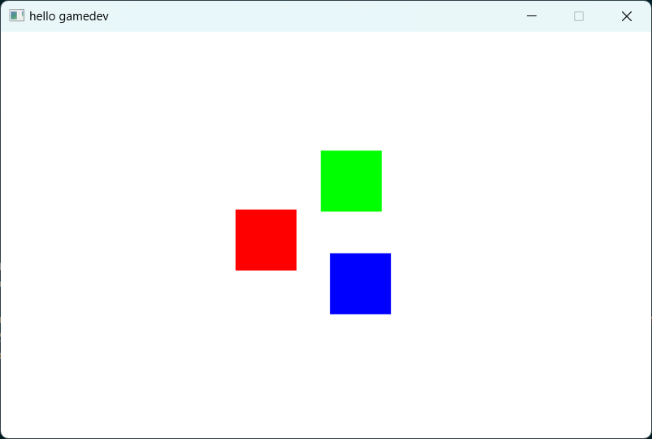

# Zig examples [⬆](../README.md#top)

<table style="font-family:Helvetica,Arial;line-height:1.6;">
  <tr>
  <td style="border:0;padding:0 10px 0 0;min-width:100px;"></td>
  <td style="border:0;padding:0;vertical-align:text-top;">Directory <strong><code>sdl-examples\</code></strong> contains <a href="https://ziglang.org//" alt="Zig">Zig</a> code examples using <a href="https://www.libsdl.org/">SDL</a>, a cross-platform library providing low level access to audio, keyboard, mouse, joystick, and graphics hardware.
  </td>
  </tr>
</table>

> **&#9755;** Read the document ["Introduction to SDL 2.0"](https://wiki.libsdl.org/SDL2/Introduction) for a quick overview od the [SDL library](https://www.libsdl.org/),

## `hello-gamedev` Example [**&#x25B4;**](#top)

This project depends on [version 2][sdl2_download] of the SDL library; it has the following directory structure :

<pre style="font-size:80%;">
<b>&gt; <a href="https://learn.microsoft.com/en-us/windows-server/administration/windows-commands/tree" rel="external">tree</a> /f /a . | <a href="https://learn.microsoft.com/en-us/windows-server/administration/windows-commands/findstr" rel="exernal">findstr</a> /v /b [A-Z]</b>
|   <a href="./hello-gamedev/00download.txt">00download.txt</a>
|   <a href="./hello-gamedev/build.bat">build.bat</a>
|   <a href="./hello-gamedev/build.sh">build.sh</a>
|   <a href="./hello-gamedev/build.zig">build.zig</a>
|   <a href="./hello-gamedev/Makefile">Makefile</a>
\---<b>src</b>
    \---<b>main</b>
        \---<b>zig</b>
                <a href="./hello-gamedev/src/main/zig/main.zig">main.zig</a>
</pre>

Command [**`build.bat`**](./hello-gamedev/build.bat)`-verbose clean run` generates and executes the Zig program `target\hello.exe`:

<pre style="font-size:80%;">
<b>&gt; <a href="./hello-gamedev/build.bat">build</a> -verbose clean run</b>
Delete directory "target"
Delete directory ".zig-cache"
Compile 1 Zig source file to directory "target"
Copy SDL2 dynamic library to directory "target"
Execute Zig program "build\hello.exe"
</pre>

<!--=======================================================================-->

## `hello-gamedev-sdl3` Example [**&#x25B4;**](#top)

This project depends on [version 3][sdl3_download] of the SDL library; it has the following directory structure :

<pre style="font-size:80%;">
<b>&gt; <a href="https://learn.microsoft.com/en-us/windows-server/administration/windows-commands/tree" rel="external">tree</a> /f /a . | <a href="https://learn.microsoft.com/en-us/windows-server/administration/windows-commands/findstr" rel="exernal">findstr</a> /v /b [A-Z]</b>
|   <a href="./hello-gamedev-sdl3/00download.txt">00download.txt</a>
|   <a href="./hello-gamedev-sdl3/build.bat">build.bat</a>
|   <a href="./hello-gamedev-sdl3/build.sh">build.sh</a>
|   <a href="./hello-gamedev-sdl3/build.zig">build.zig</a>
|   <a href="./hello-gamedev-sdl3/Makefile">Makefile</a>
\---<b>src</b>
    \---<b>main</b>
        \---<b>zig</b>
                <a href="./hello-gamedev-sdl3/src/main/zig/main.zig">main.zig</a>
</pre>

Command [**`build.bat`**](./hello-gamedev-sdl3/build.bat)`-verbose clean run` generates and executes the Zig program `build\hello.exe`:

<pre style="font-size:80%;">
<b>&gt; <a href="./hello-gamedev-sdl3/build.bat">build</a> -verbose clean run</b>
Delete directory "target"
Delete directory ".zig-cache"
Compile 1 Zig source file to directory "target"
Copy SDL3 dynamic library to directory "target"
Execute Zig program "target\hello.exe"
</pre>

<!--=======================================================================-->

***

*[mics](https://lampwww.epfl.ch/~michelou/)/January 2025* [**&#9650;**](#top)
&nbsp;

<!-- link refs -->

[pelook]: https://www.majorgeeks.com/files/details/pelook.html
[sdl2_download]: https://github.com/libsdl-org/SDL/releases/tag/release-2.30.8
[sdl3_download]: https://github.com/libsdl-org/SDL/releases/tag/preview-3.1.3
